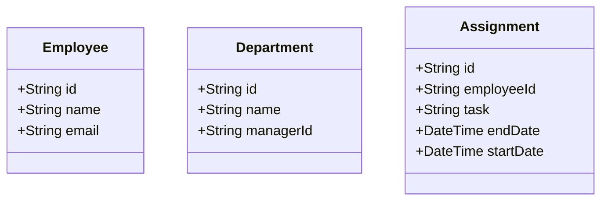
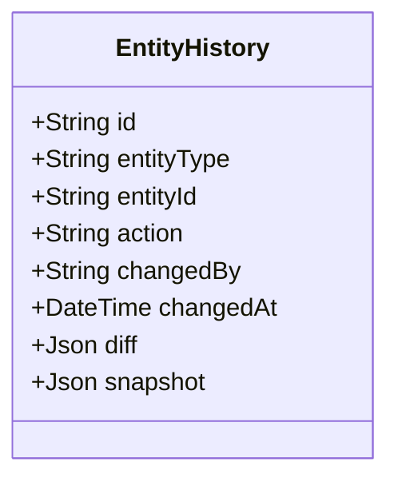

# Implementing Entity Audit Log with Prisma

## What is an Audit Log
An audit log is a record of changes made to data within an application. It provides a detailed history of who made changes, what changes were made, and when they occurred. Audit logs are essential for maintaining data integrity, security, and accountability in applications.

## What is Prisma

Prisma is an open-source database toolkit that simplifies database access and management for developers. It provides a type-safe and intuitive API for interacting with databases, allowing developers to focus on building applications without worrying about the underlying database queries. Prisma supports various databases, including PostgreSQL, MySQL, SQLite, and more.

--------------------------------

In this article, we will explore how to implement entity audit logging using Prisma, including the necessary schema definitions, middleware setup, and querying of audit logs.
The example use case we will consider is a system which manages employees, departments, and assignments. In this system, we can observe the following business entities:



Now traditional ORM based Entity Audit Log frameworks often rely on history table per Entity. That means each entity (e.g., Employee, Department, Assignment) would have its own dedicated history table to track changes. This approach can lead to a proliferation of tables and increased complexity in managing audit logs across different entities. Instead, we can implement a more streamlined solution using a single audit log table that captures changes for all entities in a unified manner.



With this structure in place, we can easily track changes across all entities without the need for multiple history tables. Each entry in the `EntityHistory` table will contain all the necessary information to understand the context of the change, including the entity type, ID, action performed, user who made the change, and timestamps. The `diff` field will capture the specific changes made to the entity, while the `snapshot` field will store the complete state of the entity before the change. This unified approach simplifies the management of audit logs and provides a comprehensive view of all changes within the system.

We could implement this using a separate component which will store the actual generation of diff and snapshot data together with other related metadata.
Then this component can be used in all CRUD operations to automatically log changes to the `EntityHistory` table.

The main downside of this approach is that it introduces additional complexity in terms of managing the audit log component. Missing to properly configure this component in all relevant parts of the application could lead to gaps in the audit log, making it difficult to track changes accurately.

So a better approach is to integrate the audit logging functionality directly into the Prisma middleware layer. By doing this, we can ensure that all relevant changes are automatically captured and logged without requiring explicit calls to the audit log component in every CRUD operation. This approach leverages Prisma's middleware capabilities to intercept database operations and generate the necessary audit log entries on-the-fly. We can configure the middleware to maintain audit logs for all relevant entities only.

Following is a draft implementation of such middleware:

```typescript
import { Prisma, type PrismaClient } from "@prisma/client";
import { ContextManager } from "../contextMiddleware";
import type { Action, EntityType, Snapshot } from "../models/EntityHistory";
import { diff } from "./EntityDiff";

export function createEntityHistoryMiddleware(client: PrismaClient) {
  const fetchCurrentSnapshot = async (
    id: number | undefined,
    model: "Employee" | "Department" | "Assignment" | "EntityHistory"
  ): Promise<Snapshot | null> => {
    switch (model) {
      case "Employee":
        return client.employee.findUnique({ where: { id } });
      case "Department":
        return client.department.findUnique({ where: { id } });
      case "Assignment":
        return client.assignment.findUnique({ where: { id } });
      default:
        return null;
    }
  };

  const record = async (
    action: Action,
    current: Snapshot | null,
    incoming: Snapshot | null
  ): Promise<void> => {
    if (!incoming && !current) {
      throw new Error("At least one of current or incoming must be provided");
    }
    const snapshot = current ? current : incoming!;
    const entityId = snapshot.id;

    if (!entityId) {
      throw new Error("Snapshot must have an id");
    }

    const diffs = diff(current, incoming);
    if (diffs.patches.length === 0) {
      return; // No changes to record
    }

    const context = ContextManager.get();
    const currentUser = context?.userId || "system";

    await client.entityHistory.create({
      data: {
        action: action,
        changedBy: currentUser,
        changedAt: new Date(),
        entityId: entityId,
        entityType: getEntityType(snapshot),
        diff: JSON.stringify(diffs),
        snapshot: JSON.stringify(current),
      },
    });
  };

  const getEntityType = (snapshot: Snapshot): EntityType => {
    if ("firstName" in snapshot) {
      return "employee";
    } else if ("managerId" in snapshot) {
      return "department";
    } else {
      return "assignment";
    }
  };

  return Prisma.defineExtension({
    query: {
      $allModels: {
        async create({ args, query, model }) {
          if (model === "EntityHistory") {
            return;
          }

          const incoming = await query(args);
          await record("created", null, incoming);
          return incoming;
        },

        async createMany({ args, query, model }) {
          throw new Error("Not supported by EntityHistoryMiddleware");
        },

        async update({ args, query, model }) {
          if (model === "EntityHistory") {
            return;
          }

          const current = await fetchCurrentSnapshot(args.where.id, model);
          const incoming = await query(args);
          await record("changed", current, incoming);
          return incoming;
        },

        async updateMany({ args, query, model }) {
          throw new Error("Not supported by EntityHistoryMiddleware");
        },

        async delete({ args, query, model }) {
          if (model === "EntityHistory") {
            return;
          }

          const current = await fetchCurrentSnapshot(args.where.id, model);
          const incoming = await query(args);
          await record("deleted", current, incoming);
          return incoming;
        },

        async deleteMany({ args, query, model }) {
          throw new Error("Not supported by EntityHistoryMiddleware");
        },
      },
    },
  });
}
```

The `EntityDiff` module implements the diffing logic for the entity snapshots. This implementation I have chosen to keep the diff in JSON Patch format, which is a standard format for representing changes to JSON documents.
This allows for a more structured representation of the changes made to each entity, making it easier to understand and apply the changes if needed.
Also at the same time a consumer can easily interpret the changes and present it visually in a UI component.

The complete implementation of this solution can be found in the GitHub repository [https://github.com/gayanper/gap-techblog-src/tree/main/entity-audit-trail](https://github.com/gayanper/gap-techblog-src/tree/main/entity-audit-trail)

One could clone the repository and go into directory `entity-audit-trail` to explore the code further. Also you could simply execute the following commands in order to populate a local database with some sample data:

```bash
docker compose --file docker-compose.yaml up

npm install
npm run build
npm run migrate
npm run start-server
npx run seed-scenarios
```

and explore how it works for yourself.

## Performance

I have not evaluated the performance of this solution in detail, but from the design itself it is obvious that this is not suitable for high write-volume applications.
But this should be sufficient for most applications which do not have a very high write volume.

If a use case expects faster queries for audit logs with filtering support, one could consider separating the JSON fields into a separate table given these fields can be large in size.
This could improve performance on queries which do not require the full snapshot or diff data. But this should be done after careful consideration of the specific use case and performance requirements.

## Wrapping up

Entity audit logs bring clarity and trust to your data. By capturing snapshots and JSON-Patch diffs at the Prisma middleware level you get consistent, centralized history without scattering audit logic throughout your codebase. The example in this repo is a practical starting point — tweak the schema, diff strategy, and retention to fit your needs.

Give it a spin locally, open an issue or PR with ideas, and enjoy cleaner, more auditable systems.
